# Lập trình thiết bị di động - 65130430

### Cài đặt:
---
*   **Android Studio** (Hedgehog hoặc mới hơn)
*   **Android 7.0 (Nougat API 24)** trở lên
*   **Java SE Development Kit (JDK 11)**

*Mô tả*
## Đây là kho lưu trữ bài tập môn Lập trình thiết bị di động. Các bài tập được thực hiện nhằm mục đích học tập và tham khảo.

---
*Quá trình thực hiện bài tập*

### Bài tập 16: Ôn tập Bottom Navigation Menu (OnThi_BottomNavigationMenu)
[Chi tiết bài tập](./OnThi_BottomNavigationMenu/app/src/main/java/thi/dat65130430/onthi_bottomnavigationmenu/MainActivity.java)

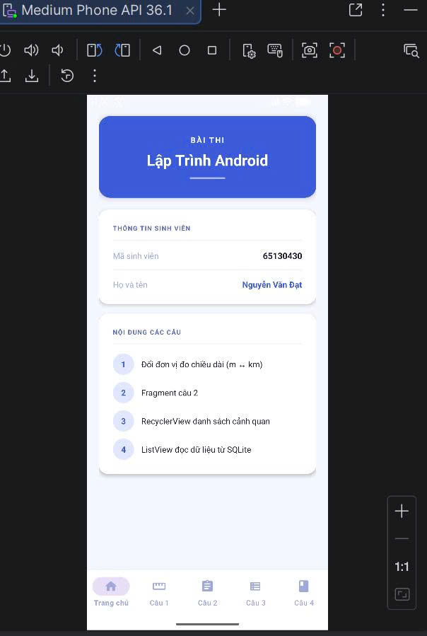
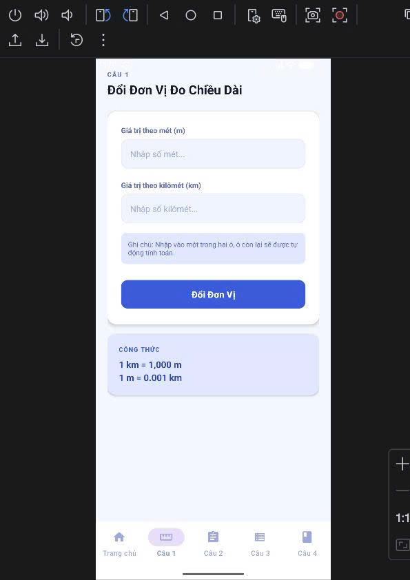
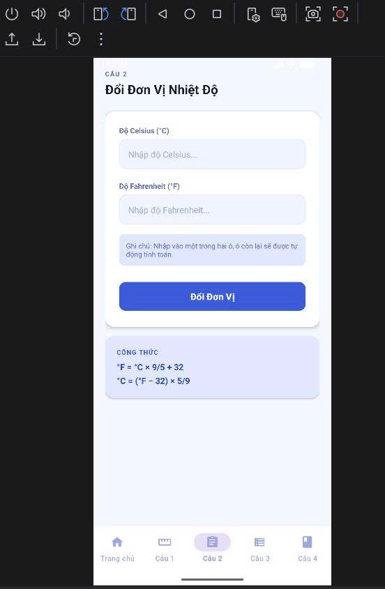

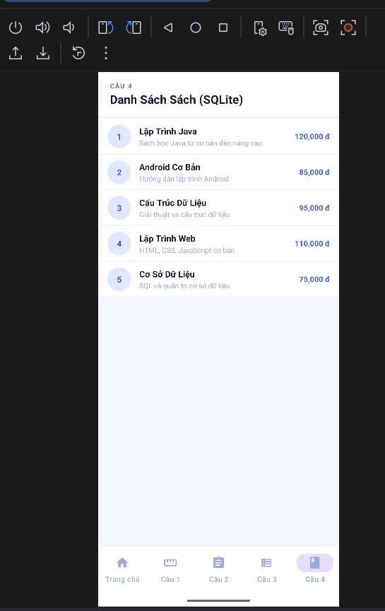
*Ứng dụng ôn tập sử dụng Bottom Navigation Menu để chuyển đổi giữa các Fragment (Trang chủ, Bài học, Thống kê).*

---

### Bài tập 15: Học Android Fragment (FragmentEx_static_dynamic_replace)
[Chi tiết bài tập](./FragmentEx_static_dynamic_replace/app/src/main/java/com/dat/fragmentex_static_dynamic_replace/MainActivity.java)

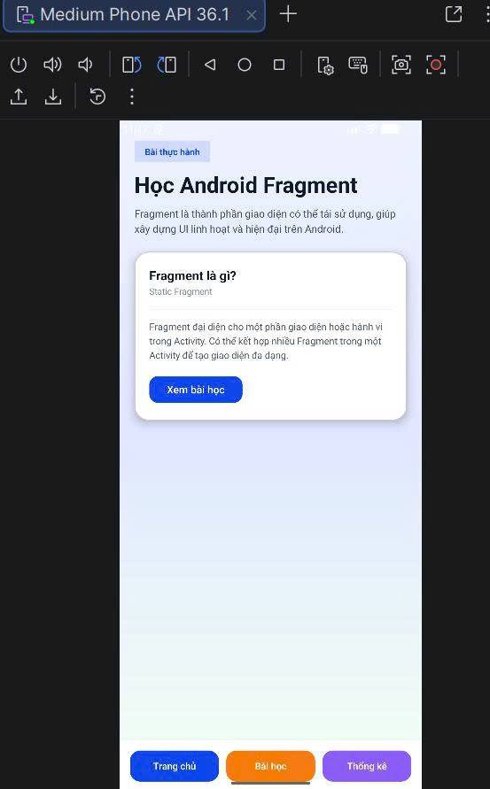
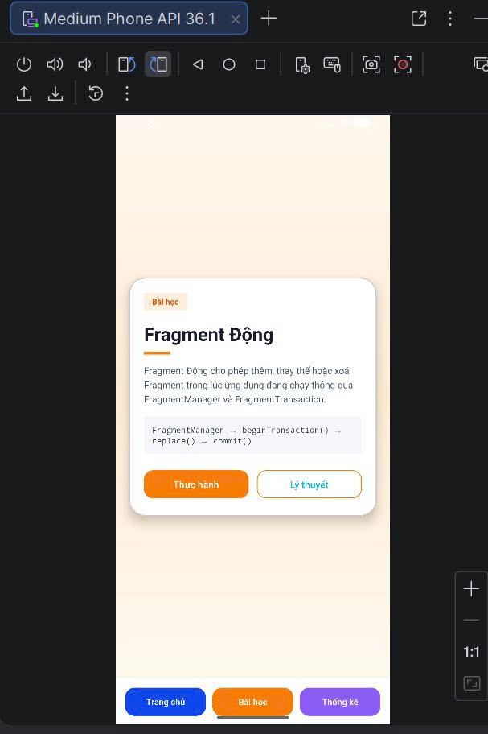
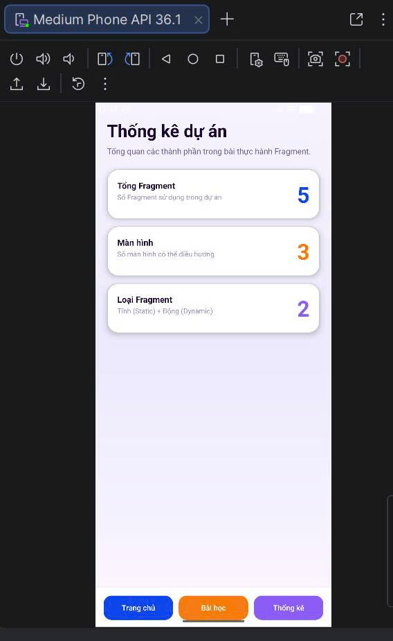
*Ứng dụng minh họa cách sử dụng Fragment tĩnh, Fragment động và thay thế (replace) Fragment trong Android.*

---

### Bài tập 14: Chuyển màn hình (ListViewMultiDataApp)
[Chi tiết bài tập](./ListViewMultiDataApp/app/src/main/java/com/dat/listviewmultidataapp/MainActivity.java)

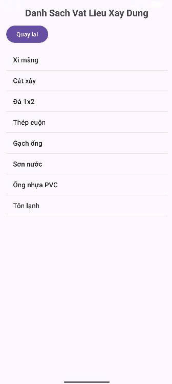
*Ứng dụng hiển thị danh sách dữ liệu phức hợp và thực hiện chuyển đổi giữa các màn hình.*

---

### Bài tập 13: Đọc báo tổng hợp (DocBaoTongHop)
[Chi tiết bài tập](./DocBaoTongHop/app/src/main/java/com/dat/docbaotonghop/MainActivity.java)

*Ứng dụng đọc báo với giao diện danh sách các tin tức tổng hợp.*

---

### Bài tập 12: Danh sách cảnh quan (DanhSachCanhQuan)
[Chi tiết bài tập](./DanhSachCanhQuan/app/src/main/java/com/dat/danhsachcanhquan/MainActivity.java)

*Ứng dụng hiển thị danh sách các cảnh quan đẹp sử dụng Custom Adapter.*

---

### Bài tập 11: Danh sách món ăn (AppMonAn)
[Chi tiết bài tập](./AppMonAn/app/src/main/java/com/dat/appmonan/MainActivity.java)

*Ứng dụng hiển thị danh sách món ăn sử dụng ListView/RecyclerView với thông tin chi tiết.*

---

### Bài tập 10: Danh sách đội bóng (DanhSachDoiBong)
[Chi tiết bài tập](./DanhSachDoiBong/app/src/main/java/com/dat/danhsachdoibong/MainActivity.java)

*Sử dụng Custom ListView để hiển thị danh sách các đội bóng đá.*

---

### Bài tập 9: Danh sách tỉnh thành (DanhSachTinhThanh)
[Chi tiết bài tập](./DanhSachTinhThanh/app/src/main/java/com/dat/danhsachtinhthanh/MainActivity.java)

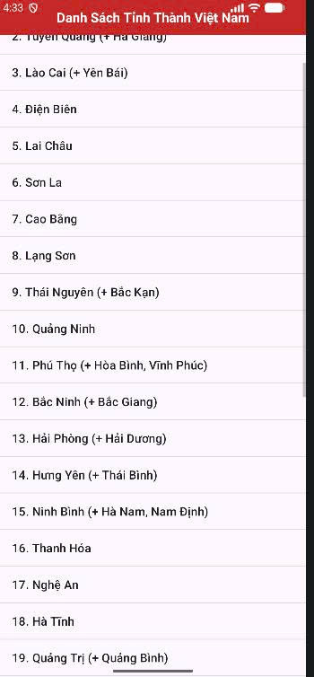
*Sử dụng ListView cơ bản để hiển thị danh sách các tỉnh thành tại Việt Nam.*

---

### Bài tập 8: Tính điểm trung bình (AverageScoreApp)
[Chi tiết bài tập](./AverageScoreApp/app/src/main/java/com/dat/averagescoreapp/MainActivity.java)

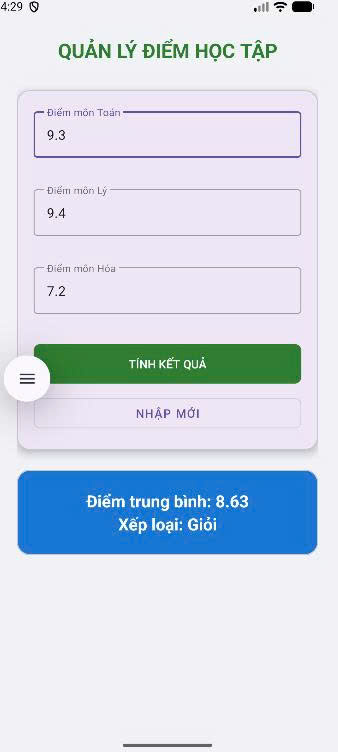
*Ứng dụng nhập điểm các môn học và tính điểm trung bình tích lũy.*

---

### Bài tập 7: Chuyển đổi nhiệt độ (TemperatureConverterApp)
[Chi tiết bài tập](./TemperatureConverterApp/app/src/main/java/com/dat/temperatureconverterapp/MainActivity.java)

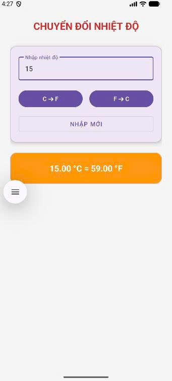
*Ứng dụng chuyển đổi qua lại giữa độ C và độ F.*

---

### Bài tập 6: Giải phương trình bậc 2 (AppGiaiPTBac2)
[Chi tiết bài tập](./AppGiaiPTBac2/app/src/main/java/com/dat/appgiaiptbac2/MainActivity.java)

*Ứng dụng giải phương trình bậc 2 (ax² + bx + c = 0) với các trường hợp nghiệm.*

---

### Bài tập 5: Tính chỉ số BMI (AppBMI)
[Chi tiết bài tập](./AppBMI/app/src/main/java/com/dat/appbmi/MainActivity.java)

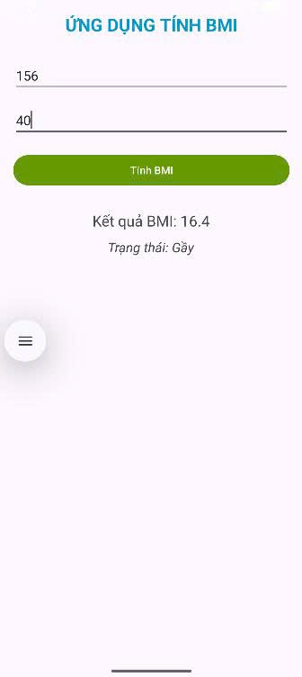
*Ứng dụng tính toán chỉ số khối cơ thể (BMI) dựa trên chiều cao và cân nặng.*

---

### Bài tập 4: Các phép toán cơ bản (LinearLayout02)
[Chi tiết bài tập](./LinearLayout02/app/src/main/java/com/dat/linearlayout02/MainActivity.java)

*Ứng dụng thực hiện Cộng, Trừ, Nhân, Chia sử dụng Layout lồng nhau.*

---

### Bài tập 3: Giao diện LinearLayout (Linearlayout01)
[Chi tiết bài tập](./Linearlayout01/app/src/main/java/com/dat/linearlayout01/MainActivity.java)

*Thực hành thiết kế giao diện Android với LinearLayout cơ bản.*

---

### Bài tập 2: Tính tổng hai số (XuLySuKien_TinhTong)
[Chi tiết bài tập](./XuLySuKien_TinhTong/app/src/main/java/com/dat/xulysukien_tinhtong/MainActivity.java)

*Ứng dụng xử lý sự kiện click để tính tổng của hai số nguyên.*

---

### Bài tập 1: Hello Android (HelloAndroid)
[Chi tiết bài tập](./HelloAndroid/app/src/main/java/com/dat/helloandroid/MainActivity.java)

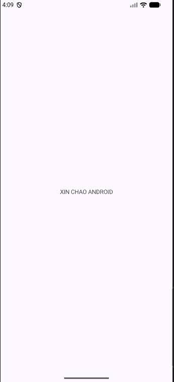
*Ứng dụng Android đầu tiên hiển thị dòng chữ chào mừng.*

---

## Hướng dẫn sử dụng
1. Mở **Android Studio**.
2. Chọn **Open** và dẫn đến thư mục của từng bài tập cụ thể.
3. Chờ Gradle đồng bộ (Sync) hoàn tất.
4. Nhấn nút **Run** (phím tắt Shift + F10) để chạy trên thiết bị giả lập hoặc thật.
